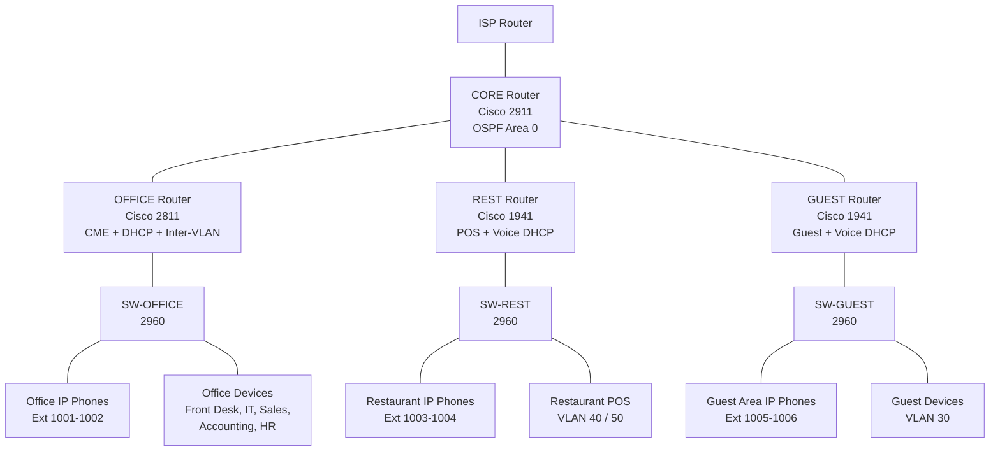
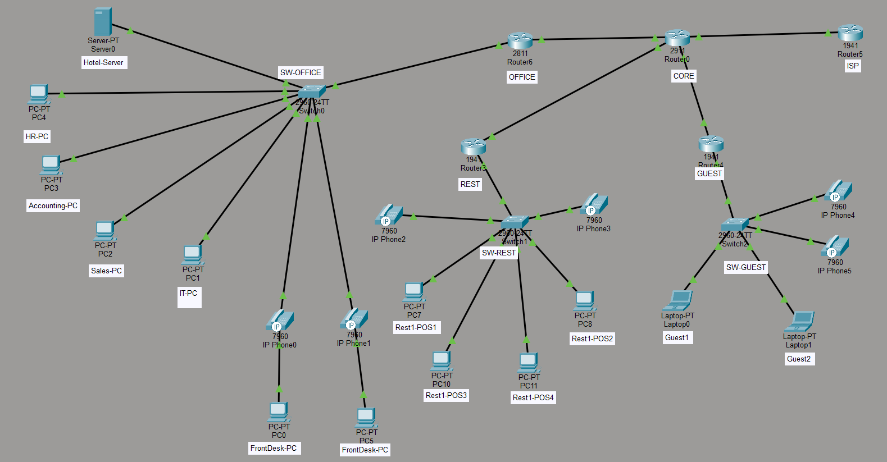

# Hotel Business Enterprise Network (Packet Tracer)

Enterprise-style hotel network built in Cisco Packet Tracer with multi-router OSPF, departmental VLAN segmentation, DHCP, guest and restaurant networks, and end-to-end VoIP phone communication.

## Repository Contents

- `HotelBusinessNetworkingLab.pkt` - main Packet Tracer lab file
- `README.md` - project overview, architecture, and deployment summary
- `docs/STEP_BY_STEP.md` - detailed implementation guide and command set
- `screenshots/` - placeholder folder for topology and validation screenshots

## Architecture Diagram (Mermaid)



## Final Network Scope

### Routing and Core Services

- Multi-router design with OSPF (Area 0)
- Inter-VLAN routing using router-on-a-stick on branch routers
- DHCP pools by department and voice segment
- ISP simulation with upstream reachability

### Department and Functional Segmentation

- Front Desk (VLAN 10)
- IT (VLAN 20)
- Guest WiFi/Data (VLAN 30)
- Restaurant 1 POS (VLAN 40)
- Restaurant 2 POS (VLAN 50)
- Sales and Marketing (VLAN 70)
- Accounting (VLAN 80)
- HR (VLAN 90)
- Voice VLANs (Office 150, Restaurant 160, Guest Area 170)

### VoIP Design

- Centralized Call Manager Express (CME) on OFFICE router
- Office phones registered and tested
- Restaurant phones registered and tested
- Guest-area phones registered and tested
- Cross-network calling verified between all sites

## IP Plan Summary

### Router Interconnects

- CORE <-> OFFICE: 10.0.0.0/30
- CORE <-> REST: 10.0.0.4/30
- CORE <-> GUEST: 10.0.0.8/30
- CORE <-> ISP edge: 200.1.1.0/24

### Voice Networks

- Office Voice: 192.168.150.0/24
- Restaurant Voice: 192.168.160.0/24
- Guest-Area Voice: 192.168.170.0/24

## Step-by-Step Build Log

The full implementation walkthrough derived from the build session is in:

- `docs/STEP_BY_STEP.md`

It includes:

- Device placement and naming
- Cable mapping
- Router/switch configuration order
- OSPF validation
- DHCP and VLAN troubleshooting checkpoints
- CME registration flow and phone extension mapping

## Screenshot Placeholders

Add your screenshots to `screenshots/` using the suggested names below.

Recommended files:

- `screenshots/01-topology-overview.png`
- `screenshots/02-core-routing-table.png`
- `screenshots/03-ospf-neighbors.png`
- `screenshots/04-office-voip-registered.png`
- `screenshots/05-restaurant-voice-dhcp.png`
- `screenshots/06-cross-site-call-test.png`

Then reference them in this README as needed:

```md

```

## Validation Checklist

- OSPF neighbors reached FULL state across core and branch routers
- Department PCs/POS endpoints obtained DHCP leases in correct VLAN ranges
- Guest and restaurant endpoints reached ISP test IP after routing fixes
- All configured VoIP endpoints registered to CME and placed successful calls

## Notes on Packet Tracer Compatibility

- Router model behavior may differ by Packet Tracer version and image features.
- CME support was finalized on the OFFICE 2811 role in this lab flow.
- Some module/interface/NAT combinations have simulator limitations; routing-based validation was used where applicable.

## Author

Built and documented from the full guided implementation chat for hotel enterprise network design.
